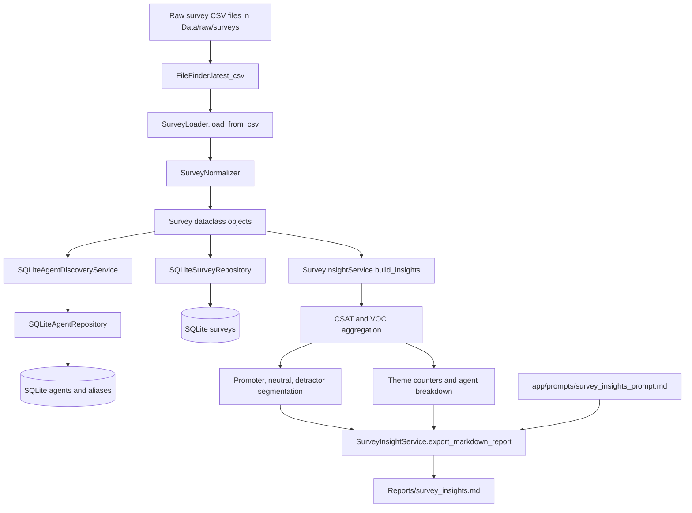
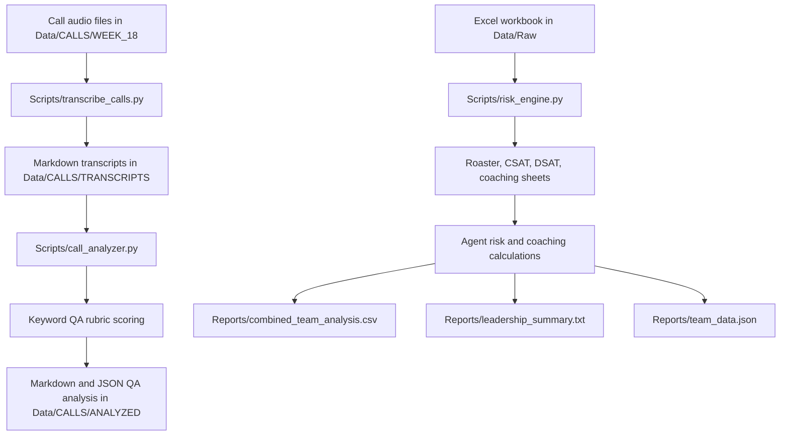

# TEAM_ANALYZER Architecture Analysis

## 1. Current Architecture Overview

TEAM_ANALYZER is a Python contact center analytics project focused on converting operational inputs into coaching, QA, CSAT, VOC, and performance insights. The repository currently contains two architectural tracks:

1. The active application pipeline in `main.py` and `app/`, which ingests survey CSV files, normalizes survey rows, discovers agents, persists surveys into SQLite, builds survey/VOC insights, and exports a Markdown report.
2. Legacy or exploratory scripts in `Scripts/`, which perform call transcription, keyword-based QA scoring, Excel-based team risk analysis, and markdown exploration. These scripts represent useful business logic but are not integrated into the active `main.py` pipeline.

The active runtime is a batch pipeline rather than a web application or API service. It is designed to run locally with:

```bash
python main.py
python main.py --reset
```

The canonical active flow is:

```text
Data/raw/surveys/*.csv
-> latest CSV discovery
-> survey type detection and normalization
-> agent discovery and alias persistence
-> survey persistence in SQLite
-> survey insight aggregation
-> Reports/survey_insights.md
```

The project uses plain Python classes, dataclasses, SQLite, pandas, Markdown outputs, and a single prompt file for AI-assisted executive interpretation. It does not currently call an LLM directly; instead, the prompt is appended to the generated report so a human or future AI integration can use it.

## 2. Folder Structure Explanation

```text
.
|-- AGENTS.md
|-- README.md
|-- Requirements.txt
|-- main.py
|-- Analyze_team.py
|-- coaching_generator.py
|-- project_structure.txt
|-- Scripts/
|   |-- call_analyzer.py
|   |-- explorer.py
|   |-- find_performance.py
|   |-- parser.py
|   |-- risk_engine.py
|   `-- transcribe_calls.py
|-- app/
|   |-- core/
|   |-- engines/
|   |-- frameworks/
|   |-- models/
|   |-- prompts/
|   |-- services/
|   `-- utils/
|-- docs/
|   `-- frameworks/
`-- tests/
```

### Repository Root

- `AGENTS.md` defines the mission, operating principles, metrics, coaching gap categories, risk levels, required agent analysis format, and coding standards.
- `README.md` documents the active survey ingestion pipeline and runtime usage.
- `Requirements.txt` lists runtime and test dependencies: `pandas`, `openpyxl`, `faster-whisper`, `ffmpeg-python`, `pyyaml`, and `pytest`.
- `main.py` is the active pipeline entrypoint.
- `Analyze_team.py` and `coaching_generator.py` are empty scaffold files.
- `project_structure.txt` is a very large tracked generated artifact and should be treated as technical debt.

### `app/core/`

Generic framework primitives:

- `Entity` in `app/core/__init__.py` models a generic operational entity.
- `Framework` groups configurable rules and metadata.
- `Metric` models target-aware operational metrics.
- `Observation` models generic observations from surveys, QA, attendance, transcripts, and coaching.
- `Rule` and `RuleResult` define threshold-based rule evaluation.

These primitives are conceptually aligned with the mission but are not yet wired into the active pipeline.

### `app/engines/`

- `rules_engine.py` evaluates `Metric` objects against a `Framework` and returns `RuleResult` objects.

This is a reusable rules engine scaffold. It is implemented, but it is not currently invoked by `main.py` or the survey insight workflow.

### `app/models/`

Dataclass models:

- `Agent`: canonical agent identity and aliases.
- `Survey`: normalized survey record.
- `Call`: call metadata scaffold.
- `QAResult`: QA scoring result scaffold.
- `Transcript`: transcript and topic metadata scaffold.

`Agent` and `Survey` are used by the active pipeline. `Call`, `QAResult`, and `Transcript` are present but not integrated into the active runtime.

### `app/services/`

Active services:

- `CleanupService`: cleans caches, reports, database outputs, and generated call folders.
- `DatabaseService`: initializes SQLite tables for agents, aliases, and surveys.
- `SurveyNormalizer`: detects call/chat survey formats and maps rows to canonical fields.
- `SurveyLoader`: loads pandas CSV data into `Survey` objects.
- `SQLiteAgentDiscoveryService`: derives agent records and aliases from survey data.
- `SQLiteAgentRepository`: persists and resolves agents and aliases in SQLite.
- `SQLiteSurveyRepository`: persists survey records and calculates CSAT as OSAT score times 10.
- `SurveyInsightService`: builds CSAT, VOC theme, promoter/detractor, and agent-level insight summaries and exports Markdown.
- `SurveyAnalyticsService`: builds agent survey summaries and exports CSV, but is not called by `main.py`.
- `AgentRegistry`: in-memory identity lookup and JSON loading helper.

Scaffold or disconnected services:

- `AgentDiscoveryService`: JSON master-file agent discovery, mostly superseded by SQLite discovery in the active pipeline.
- `SurveyRepository`, `CallRepository`, `QARepository`, and `TranscriptRepository`: in-memory repositories useful for tests or future orchestration, but not used in the active pipeline.
- `call_ingestion_service.py`: empty scaffold.

### `app/prompts/`

- `survey_insights_prompt.md` defines the PMCE executive analysis prompt appended to the generated survey insights report.

### `app/utils/`

- `FileFinder` resolves latest CSV or Excel files by modification time.

### `Scripts/`

Legacy and exploratory utilities:

- `transcribe_calls.py`: transcribes `.mp4` call recordings with `faster_whisper` into Markdown transcripts.
- `call_analyzer.py`: keyword/rubric-based QA scoring and coaching summaries for transcripts.
- `risk_engine.py`: Excel-based team performance, CSAT, DSAT, coaching, and risk analysis.
- `parser.py`, `find_performance.py`, `explorer.py`: exploratory Markdown parsing and keyword search utilities.

These scripts show important business capabilities but are not integrated into the `app/` service architecture.

### `docs/frameworks/`

Framework definition stubs:

- `PMCE.md`
- `QA_STANDARD.md`
- `VOC_FRAMEWORK.md`
- `COACHING_STANDARD.md`

These documents define intent at a high level but do not yet contain detailed rule definitions, scoring rubrics, or configuration that the active pipeline can consume.

### `tests/`

- `test_survey_normalizer.py` validates call/chat survey normalization, fallback fields, missing optional fields, score precedence, and numeric ID cleanup.

## 3. Data Flow Diagram



Legacy script flow:



## 4. Service Dependencies

### Active Pipeline Dependencies

```text
main.py
|-- CleanupService
|-- DatabaseService
|-- FileFinder
|-- SurveyLoader
|   |-- pandas
|   |-- SurveyNormalizer
|   `-- Survey
|-- AgentRegistry
|-- SQLiteAgentDiscoveryService
|   `-- SQLiteAgentRepository
|-- SQLiteAgentRepository
|   `-- DatabaseService
|-- SQLiteSurveyRepository
|   `-- DatabaseService
`-- SurveyInsightService
    |-- AgentRegistry
    `-- app/prompts/survey_insights_prompt.md
```

### Core Framework Dependencies

```text
Framework -> Rule
RulesEngine -> Framework, Metric, RuleResult
Rule -> RuleResult
Observation -> standard dataclass metadata
Metric -> target/min/max comparisons
```

The framework layer is implemented as a generic reusable model but is not connected to the active survey pipeline, prompt generation, QA scoring, or coaching recommendations.

### Script Dependencies

- `Scripts/transcribe_calls.py` depends on `faster_whisper` and local audio files.
- `Scripts/call_analyzer.py` depends on transcript Markdown files and hard-coded keyword rubrics.
- `Scripts/risk_engine.py` depends on `pandas`, `openpyxl`, and a specific Excel workbook/sheet structure.
- `Scripts/parser.py`, `Scripts/find_performance.py`, and `Scripts/explorer.py` depend on a specific `Data/Markdown/TeamJV_MAY.md` file.

## 5. Repository Pattern Usage

The repository pattern exists in two forms:

### SQLite Repositories

- `SQLiteAgentRepository` persists agents and aliases into SQLite.
- `SQLiteSurveyRepository` persists surveys into SQLite and provides `all_surveys()`.

These are the active persistence repositories used by `main.py`.

Strengths:

- Clear separation between persistence and orchestration.
- SQLite schema is initialized in one service.
- Agent matching supports multiple identity fields and alias lookup.
- Survey upsert protects idempotent contact-level loads.

Limitations:

- Repositories contain SQL directly and do not expose typed model return values.
- There are no repository interfaces or protocols.
- Survey repository calculates CSAT inline as `score * 10`, which mixes persistence with business calculation.
- Only agents and surveys have SQLite implementations.

### In-Memory Repositories

- `SurveyRepository`
- `CallRepository`
- `QARepository`
- `TranscriptRepository`

These are simple dictionary-backed repositories. They are useful as future test doubles or domain scaffolds but are not connected to `main.py`.

Limitations:

- No shared base interface with SQLite repositories.
- No active orchestration uses them.
- They do not support persistence, filtering beyond a few lookup helpers, or business analytics.

## 6. Existing Business Capabilities

### Implemented

- Latest survey CSV discovery.
- Call vs chat survey detection.
- Survey normalization into canonical fields.
- Agent discovery from survey agent number/name.
- Alias normalization for names, numeric IDs, and accent-insensitive variants.
- SQLite persistence for agents, aliases, and surveys.
- Survey upsert by contact ID.
- CSAT scaling from 0-10 score to 0-100 score.
- Promoter, neutral, and detractor classification.
- VOC theme keyword detection.
- Promoter and detractor driver summaries.
- Positive and negative VOC sample extraction.
- Agent-level survey counts, average CSAT, and promoter/neutral/detractor counts.
- Markdown survey insight report generation.
- PMCE prompt appended to the report for AI interpretation.
- Unit tests for survey normalization.

### Partially Implemented

- Agent analytics through survey breakdowns and `SurveyAnalyticsService`.
- QA analytics through `Scripts/call_analyzer.py` and `QAResult`, but not integrated into the active application.
- Coaching recommendations through prompt instructions and script-generated summaries, but no persisted coaching workflow.
- Risk classification through script logic and generic rule primitives, but no unified runtime risk engine.
- Call transcription through `Scripts/transcribe_calls.py`, but no call ingestion service integration.
- Framework-based rule evaluation through `app/core` and `RulesEngine`, but no production rules loaded from docs or config.

### Scaffolded

- Call ingestion service.
- Call, QA result, and transcript repositories.
- Generic entity, observation, metric, framework, and rule abstractions.
- Empty `Analyze_team.py` and `coaching_generator.py`.

## 7. Missing Capabilities

- End-to-end call analytics integration from audio ingestion to transcript, QA result, coaching recommendation, and repository persistence.
- Configurable QA rubric loaded from `docs/frameworks/QA_STANDARD.md` or a structured config file.
- Structured PMCE evaluation in code rather than only in prompt text.
- Structured VOC root-cause taxonomy tied to controllable/non-controllable drivers.
- Persistent coaching session model, SMART commitment tracking, follow-up cadence, and supervisor action history.
- Full agent performance scorecards combining CSAT, QA, AHT, adherence, attendance, AUX, productivity, sales conversion, and UPT.
- Operational dashboards or API endpoints.
- Data validation and schema contracts for survey CSV formats.
- Migration strategy for SQLite schema changes.
- Automated prompt execution with an LLM provider.
- Test coverage for repositories, insight generation, rules, risk logic, scripts, and end-to-end pipeline behavior.

## 8. Technical Debt

- `project_structure.txt` is a large generated artifact tracked in source control.
- There are two overlapping agent discovery approaches: JSON master-file discovery and SQLite discovery.
- Legacy `Scripts/` modules contain business value but use hard-coded paths and are disconnected from `app/`.
- Several empty or scaffold files create unclear implementation status.
- Framework docs are too thin to drive code behavior.
- Rules and metrics primitives are not wired into the active pipeline.
- Business constants such as CSAT thresholds, VOC keywords, risk thresholds, and QA rubrics are hard-coded.
- `SurveyInsightService` combines analytics, prompt loading, Markdown rendering, and report export in one class.
- Agent registry is instantiated empty in the active pipeline, so runtime matching mostly relies on SQLite discovery rather than preloaded master data.
- No formal application configuration layer exists despite an `app/config/` package.
- No CI workflow is present in the repository tree.
- `Requirements.txt` uses nonstandard capitalization compared with common `requirements.txt` conventions.

## 9. Recommended Roadmap

### Phase 1: Stabilize The Active Survey Pipeline

- Add integration tests for `main.py` using temporary survey CSVs and SQLite databases.
- Move CSAT thresholds, VOC keywords, and report limits into configuration.
- Split `SurveyInsightService` into analytics, report rendering, and prompt-loading components.
- Add repository return types and typed query helpers.
- Add documentation for supported survey column mappings.

### Phase 2: Make Frameworks Executable

- Expand framework docs into structured definitions or add YAML/JSON configs for PMCE, QA, VOC, coaching, and risk rules.
- Connect `RulesEngine` to survey and QA metrics.
- Convert script risk thresholds into reusable rule objects.
- Add tests for `Metric`, `Rule`, `Framework`, and `RulesEngine`.

### Phase 3: Integrate QA And Call Analytics

- Move `Scripts/transcribe_calls.py` and `Scripts/call_analyzer.py` into `app/services/` as configurable services.
- Implement `call_ingestion_service.py` and connect call, transcript, and QA repositories.
- Persist calls, transcripts, and QA results in SQLite.
- Replace hard-coded transcript paths with configured input/output folders.

### Phase 4: Build Coaching And Agent Performance Workflows

- Implement coaching session models and repositories.
- Generate SMART commitments from survey, VOC, QA, and risk signals.
- Build agent scorecards combining survey, QA, attendance, adherence, AHT, AUX, productivity, and sales metrics.
- Add supervisor-level summaries and follow-up tracking.

### Phase 5: Operationalize Insights

- Add an LLM integration layer for prompt execution with safe input/output boundaries.
- Add CLI commands for survey analysis, call analysis, risk analysis, and coaching generation.
- Add CI with unit and integration tests.
- Produce consistent Markdown, CSV, and JSON outputs under `Reports/`.
- Consider a lightweight dashboard or API once the batch pipeline is stable.
