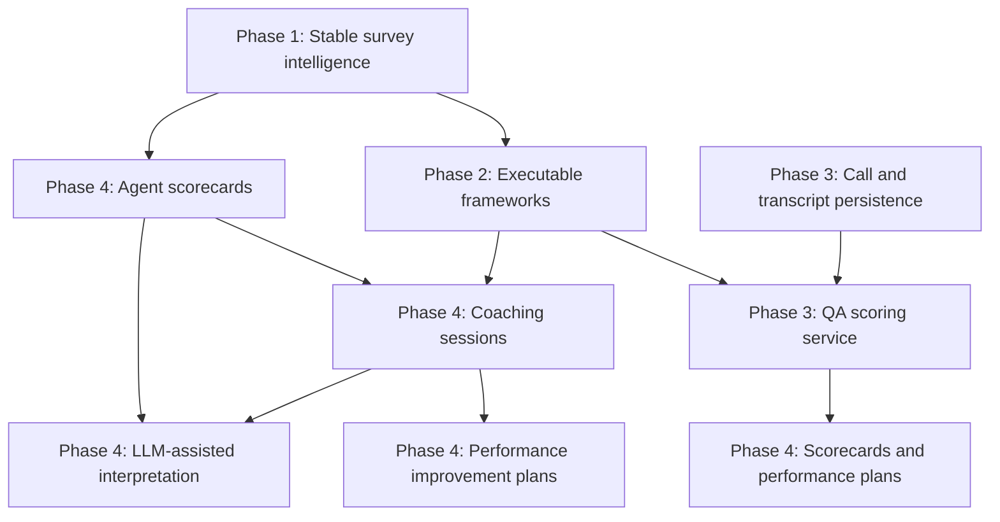

# TEAM_ANALYZER Product Roadmap V1

## Purpose

This roadmap translates the architecture and gap analysis into a solo-developer build plan for TEAM_ANALYZER as an operational intelligence platform for Contact Centers.

The plan is optimized for one developer working iteratively. It prioritizes a stable survey intelligence foundation first, then executable frameworks, then integrated QA/call analytics, and finally coaching and performance intelligence.

## Planning Assumptions

- Estimated effort is expressed in solo-developer working days.
- Complexity uses Low, Medium, High, and Very High.
- Priority uses P0, P1, P2, and P3.
- Runtime remains a local/batch Python application in V1.
- Source data under `Data/` and generated outputs under `Reports/` remain uncommitted.
- The active `main.py` survey pipeline remains the first production-quality workflow.
- Legacy `Scripts/` capabilities are integrated gradually instead of rewritten all at once.

## Phase Summary

| Phase | Theme | Outcome | Estimated Effort |
|---|---|---|---:|
| Phase 1 | Stabilize survey intelligence | Reliable survey ingestion, validation, persistence, report generation, and tests | 10-15 days |
| Phase 2 | Make frameworks executable | Configurable PMCE, QA, VOC, coaching, and risk rules connected to analytics | 12-18 days |
| Phase 3 | Integrate QA and call analytics | Calls, transcripts, QA scoring, and call-level coaching become first-class services | 15-25 days |
| Phase 4 | Build operational intelligence workflows | Agent scorecards, coaching sessions, SMART commitments, and improvement plans | 18-30 days |

## Phase 1: Stabilize Survey Intelligence

### Phase Goal

Turn the existing survey pipeline into a dependable core product capability. This phase should make TEAM_ANALYZER trustworthy for recurring CSAT/VOC analysis before adding larger platform features.

### Epic 1.1: Survey Pipeline Reliability

| Field | Value |
|---|---|
| Priority | P0 |
| Complexity | Medium |
| Estimated Effort | 3-5 days |
| Dependencies | Existing `main.py`, `SurveyLoader`, `SurveyNormalizer`, `DatabaseService`, SQLite repositories |

User stories:

- As a supervisor, I want survey files to be processed consistently, so that I can trust each generated report.
- As an operations analyst, I want missing or invalid survey fields to be reported clearly, so that I can correct source data issues quickly.
- As a developer, I want a tested end-to-end survey pipeline, so that changes do not break ingestion or reporting.

Technical stories:

- Add an end-to-end pipeline test using temporary folders, a temporary SQLite database, and synthetic call/chat survey CSVs.
- Add a survey ingestion diagnostics object that tracks rows loaded, rows skipped, missing required fields, unknown survey type, duplicate contact IDs, and normalization warnings.
- Add validation for required canonical fields: `contact_id`, `agent_id` or `agent_name`, `score`, and `survey_date` when available.
- Make `main.py` report ingestion diagnostics before insight generation.
- Keep the current survey loading behavior backward compatible for valid files.

Deliverables:

- Reliable survey load diagnostics.
- End-to-end regression coverage for the active pipeline.
- Clear console output when data quality issues exist.

### Epic 1.2: Configuration Foundation

| Field | Value |
|---|---|
| Priority | P0 |
| Complexity | Medium |
| Estimated Effort | 2-3 days |
| Dependencies | `app/config/`, `main.py`, hard-coded paths and thresholds |

User stories:

- As a developer, I want paths and thresholds centralized, so that operational behavior is easy to adjust.
- As an operations leader, I want CSAT and VOC thresholds to be explicit, so that reports align with business expectations.

Technical stories:

- Add a lightweight configuration module under `app/config/`.
- Centralize paths for survey input, database output, report output, prompt file, and generated call folders.
- Centralize CSAT thresholds for promoter, neutral, and detractor classification.
- Centralize report limits for VOC sample counts.
- Update services to receive config values through constructor arguments or orchestration wiring instead of reading hard-coded values where practical.

Deliverables:

- A single place to modify pipeline paths and business thresholds.
- Reduced hard-coded values in `main.py` and `SurveyInsightService`.

### Epic 1.3: Survey Insight Service Refactor

| Field | Value |
|---|---|
| Priority | P1 |
| Complexity | Medium |
| Estimated Effort | 3-4 days |
| Dependencies | `SurveyInsightService`, `survey_insights_prompt.md`, Phase 1.2 config |

User stories:

- As a supervisor, I want survey reports to remain consistent, so that I can compare team performance over time.
- As a developer, I want analytics separated from Markdown rendering, so that future features can reuse insight data.

Technical stories:

- Split survey insight responsibilities into analytics, Markdown rendering, and prompt loading components.
- Keep the existing report layout stable while improving internals.
- Return structured insight data objects or dictionaries that can be reused by future scorecards and coaching flows.
- Add tests for promoter/neutral/detractor classification, theme detection, agent breakdown, and Markdown output structure.

Deliverables:

- Cleaner service boundaries.
- Reusable insight data for later phases.
- Test coverage for survey analytics and report generation.

### Epic 1.4: Agent Identity Hardening

| Field | Value |
|---|---|
| Priority | P1 |
| Complexity | Medium |
| Estimated Effort | 2-3 days |
| Dependencies | `AgentRegistry`, `SQLiteAgentDiscoveryService`, `SQLiteAgentRepository` |

User stories:

- As a supervisor, I want surveys mapped to the correct agent, so that coaching and scorecards are accurate.
- As an operations analyst, I want alternate agent names and IDs resolved consistently, so that raw data variations do not fragment performance history.

Technical stories:

- Add tests for alias creation, accent normalization, numeric ID cleanup, and last-name-first conversion.
- Add repository tests for agent lookup by ID, employee ID, name, nice name, CXone name, email, and alias.
- Document canonical agent identity behavior in the knowledge base or README.
- Decide whether `AgentRegistry` should be preloaded from SQLite, JSON, or remain a helper for future use.

Deliverables:

- More reliable agent matching.
- Clearer identity behavior for future analytics.

## Phase 2: Make Frameworks Executable

### Phase Goal

Convert framework intent into configurable, testable rules. PMCE, QA, VOC, coaching, and risk should begin moving from documentation and prompt text into structured runtime behavior.

### Epic 2.1: Business Rule Configuration

| Field | Value |
|---|---|
| Priority | P0 |
| Complexity | High |
| Estimated Effort | 4-6 days |
| Dependencies | `app/core/Framework`, `Rule`, `Metric`, `RulesEngine`, Phase 1 config |

User stories:

- As an operations leader, I want thresholds and rule definitions to be visible, so that analytics match the operating model.
- As a developer, I want rules loaded from configuration, so that business logic is not scattered across scripts and services.

Technical stories:

- Add structured config files for CSAT, VOC, QA, PMCE, coaching, and risk rules.
- Implement a framework loader that converts config definitions into `Framework` and `Rule` objects.
- Add tests for rule loading, invalid rule handling, and rule evaluation.
- Connect `RulesEngine` to at least one active survey metric, such as average CSAT or detractor count.

Deliverables:

- Executable business rules.
- Framework config examples.
- Tests for framework loading and evaluation.

### Epic 2.2: VOC Taxonomy And Root Cause Model

| Field | Value |
|---|---|
| Priority | P0 |
| Complexity | High |
| Estimated Effort | 4-6 days |
| Dependencies | `SurveyInsightService`, VOC framework, Phase 2.1 rule config |

User stories:

- As a CX leader, I want customer comments classified by theme and root cause, so that I can prioritize operational fixes.
- As a supervisor, I want to know whether a detractor driver is agent controllable, process controllable, policy driven, system constrained, or non-controllable.

Technical stories:

- Create a structured VOC taxonomy config with themes, keywords, controllability, severity defaults, and responsible business area.
- Replace hard-coded VOC theme keywords with taxonomy-driven detection.
- Add a root cause result structure for each classified survey comment.
- Update the survey insight report to include controllable/non-controllable summaries.
- Add tests for theme, controllability, and root cause classification.

Deliverables:

- Structured VOC taxonomy.
- More actionable detractor analysis.
- Report sections aligned with the VOC framework.

### Epic 2.3: PMCE Evaluation Foundation

| Field | Value |
|---|---|
| Priority | P1 |
| Complexity | Medium |
| Estimated Effort | 3-5 days |
| Dependencies | PMCE framework, prompt library, Phase 2.1 rule config |

User stories:

- As a supervisor, I want customer feedback mapped to PMCE behaviors, so that coaching is tied to observable customer experience gaps.
- As a developer, I want PMCE dimensions represented in code, so that future QA and coaching workflows can reuse them.

Technical stories:

- Define PMCE dimensions as structured config: Personalize, Manage, Communicate, Execute.
- Map VOC themes and QA behaviors to PMCE dimensions.
- Add PMCE summary output to survey insights based on available evidence.
- Keep PMCE evidence lightweight in this phase: survey comments, top reasons, dispositions, and theme mappings.
- Add tests for PMCE mapping and report output.

Deliverables:

- PMCE dimension mapping in runtime.
- PMCE gap summary in survey reports.
- Foundation for coaching forms in Phase 4.

### Epic 2.4: Risk Model Foundation

| Field | Value |
|---|---|
| Priority | P1 |
| Complexity | Medium |
| Estimated Effort | 3-4 days |
| Dependencies | `Scripts/risk_engine.py`, `RulesEngine`, agent survey breakdowns |

User stories:

- As an operations leader, I want agents and teams categorized by risk, so that coaching priorities are clear.
- As a supervisor, I want risk reasons explained, so that I know what action to take first.

Technical stories:

- Extract risk logic from `Scripts/risk_engine.py` into reusable app-level functions or rule config.
- Start with survey-driven risk using average CSAT, detractor count, and controllable VOC drivers.
- Add risk levels aligned with `AGENTS.md`: Low, Moderate, High, Critical.
- Include risk reason strings in report output.
- Add tests for risk boundaries and risk reason generation.

Deliverables:

- Survey-based agent risk classification.
- Reusable risk rules ready for QA and performance metrics later.

## Phase 3: Integrate QA And Call Analytics

### Phase Goal

Turn the standalone transcription and QA scripts into first-class application capabilities. This phase connects calls, transcripts, QA results, and coaching signals to the platform architecture.

### Epic 3.1: Call And Transcript Persistence

| Field | Value |
|---|---|
| Priority | P0 |
| Complexity | High |
| Estimated Effort | 4-6 days |
| Dependencies | `Call`, `Transcript`, `DatabaseService`, `CallRepository`, `TranscriptRepository`, `Scripts/transcribe_calls.py` |

User stories:

- As a QA analyst, I want call transcripts stored with call metadata, so that audits can be reviewed later.
- As a developer, I want call and transcript repositories integrated with SQLite, so that call analytics can join with agent analytics.

Technical stories:

- Add SQLite tables for calls and transcripts.
- Implement SQLite call and transcript repositories.
- Replace or supplement in-memory repositories with persistent implementations.
- Add a call ingestion service that scans configured call audio and transcript folders.
- Add tests for call and transcript persistence.

Deliverables:

- Calls and transcripts become persisted domain objects.
- Call analytics can be joined to agents.

### Epic 3.2: Transcription Service Integration

| Field | Value |
|---|---|
| Priority | P1 |
| Complexity | High |
| Estimated Effort | 3-5 days |
| Dependencies | Phase 3.1 persistence, `faster-whisper`, configured call folders |

User stories:

- As a QA analyst, I want audio files transcribed through the app, so that call analysis starts from one workflow.
- As a developer, I want transcription isolated behind a service, so that model settings and file handling are testable.

Technical stories:

- Move `Scripts/transcribe_calls.py` behavior into an app-level transcription service.
- Add config for model name, device, compute type, input folder, and transcript output folder.
- Add dry-run and skip-existing behavior to avoid unnecessary transcription work.
- Add graceful error handling for missing `ffmpeg`, unsupported audio, and model load failures.
- Keep local generated transcripts under ignored folders.

Deliverables:

- Configurable transcription workflow.
- Safer handling of local audio processing.

### Epic 3.3: QA Scoring Service Integration

| Field | Value |
|---|---|
| Priority | P0 |
| Complexity | High |
| Estimated Effort | 5-8 days |
| Dependencies | Phase 2 rule config, Phase 3.1 transcripts, `Scripts/call_analyzer.py`, `QAResult` |

User stories:

- As a QA analyst, I want transcript QA scoring to run from the platform, so that audits are consistent and repeatable.
- As a supervisor, I want QA opportunities converted into coaching focus areas, so that follow-up is practical.

Technical stories:

- Convert the hard-coded QA rubric in `Scripts/call_analyzer.py` into structured QA config.
- Implement a QA scoring service that evaluates transcript text against QA rules.
- Persist QA results to SQLite.
- Generate QA Markdown and JSON outputs through a report renderer.
- Add tests for rubric scoring, section scores, risk level, auditor notes, and coaching summary generation.

Deliverables:

- Integrated QA scoring service.
- Persisted QA results.
- QA reports aligned with configurable standards.

### Epic 3.4: Call-Level Coaching Signals

| Field | Value |
|---|---|
| Priority | P2 |
| Complexity | Medium |
| Estimated Effort | 3-6 days |
| Dependencies | Phase 3.3 QA scoring, Phase 2 PMCE mapping |

User stories:

- As a supervisor, I want each call audit to identify coaching opportunities, so that coaching can be tied to specific evidence.
- As an agent, I want coaching feedback based on real call behaviors, so that improvement expectations are clear.

Technical stories:

- Map QA misses to PMCE dimensions and coaching gap categories.
- Generate call-level coaching signals: strengths, opportunities, root cause hint, risk level, and suggested action.
- Include contact or call IDs in generated coaching evidence.
- Prepare the output shape for Phase 4 coaching sessions.

Deliverables:

- Call-level coaching signal data.
- Bridge from QA analytics to coaching workflows.

## Phase 4: Build Operational Intelligence Workflows

### Phase Goal

Move TEAM_ANALYZER from reporting into operational intelligence: agent scorecards, coaching sessions, SMART commitments, supervisor recommendations, and performance improvement plans.

### Epic 4.1: Unified Agent Scorecard

| Field | Value |
|---|---|
| Priority | P0 |
| Complexity | Very High |
| Estimated Effort | 5-8 days |
| Dependencies | Survey analytics, QA persistence, risk model, agent identity |

User stories:

- As a supervisor, I want one scorecard per agent, so that I can understand performance without checking multiple reports.
- As an operations leader, I want scorecards to combine CSAT, VOC, QA, and risk, so that priorities are based on a complete view.

Technical stories:

- Create an agent scorecard service that joins agent identity, survey summaries, VOC themes, risk, QA results, and coaching signals.
- Add placeholders for future operational metrics: AHT, adherence, attendance, AUX, productivity, sales conversion, and UPT.
- Generate scorecard Markdown and JSON outputs.
- Add tests for scorecard aggregation and missing-data behavior.

Deliverables:

- Agent scorecards suitable for supervisor review.
- Unified analytics foundation for coaching and performance plans.

### Epic 4.2: Coaching Session Lifecycle

| Field | Value |
|---|---|
| Priority | P0 |
| Complexity | High |
| Estimated Effort | 5-8 days |
| Dependencies | Agent scorecards, PMCE mapping, risk model, QA coaching signals |

User stories:

- As a supervisor, I want coaching sessions generated from evidence, so that coaching is consistent and actionable.
- As an agent, I want clear strengths, improvement areas, and commitments, so that I know exactly how to improve.

Technical stories:

- Add coaching session, coaching recommendation, SMART commitment, and follow-up models.
- Add SQLite tables and repositories for coaching sessions and commitments.
- Generate the required `AGENTS.md` agent analysis format: coaching summary, strengths, areas of improvement, root cause, risk assessment, SMART commitment, and supervisor recommendation.
- Add status fields for open, completed, and overdue follow-ups.
- Add tests for coaching session creation and required format completeness.

Deliverables:

- Structured coaching sessions.
- SMART commitments and supervisor recommendations.
- Persistent coaching follow-up foundation.

### Epic 4.3: Performance Improvement Plans

| Field | Value |
|---|---|
| Priority | P1 |
| Complexity | High |
| Estimated Effort | 4-7 days |
| Dependencies | Agent scorecards, risk model, coaching sessions |

User stories:

- As an operations leader, I want high-risk agents assigned improvement plans, so that accountability is clear.
- As a supervisor, I want each plan to include target metrics and next actions, so that progress can be tracked.

Technical stories:

- Add a performance improvement plan model with owner, agent, risk level, target metric, action plan, due date, and status.
- Generate plans for High and Critical risk agents.
- Add plan summaries to leadership reports.
- Add simple CLI or pipeline command for generating current open plans.
- Add tests for plan creation rules and status updates.

Deliverables:

- Performance improvement plans tied to risk and coaching.
- Operational accountability artifacts.

### Epic 4.4: LLM-Assisted Interpretation

| Field | Value |
|---|---|
| Priority | P2 |
| Complexity | High |
| Estimated Effort | 4-7 days |
| Dependencies | Prompt library, scorecards, coaching output schemas, environment configuration |

User stories:

- As a supervisor, I want AI-assisted executive and coaching interpretation, so that I can act faster on complex data.
- As a developer, I want AI outputs structured and auditable, so that generated recommendations can be reviewed safely.

Technical stories:

- Add an LLM execution service behind a clear interface.
- Add environment configuration for provider credentials without exposing secrets.
- Define structured output schemas for executive summary, agent coaching form, root cause analysis, risk assessment, and next actions.
- Add prompt version metadata and prompt tests with synthetic inputs.
- Persist generated AI outputs separately from raw analytics.

Deliverables:

- Safe AI interpretation workflow.
- Structured, reviewable AI-generated recommendations.
- Prompt governance foundation.

### Epic 4.5: Operational Reporting CLI

| Field | Value |
|---|---|
| Priority | P2 |
| Complexity | Medium |
| Estimated Effort | 3-5 days |
| Dependencies | Survey reports, QA reports, scorecards, coaching sessions, performance plans |

User stories:

- As a solo operator, I want simple commands for each workflow, so that I can run the platform without editing code.
- As a developer, I want commands separated by workflow, so that maintenance is easier.

Technical stories:

- Add CLI subcommands for survey analysis, QA analysis, scorecards, coaching generation, and improvement plans.
- Keep `python main.py` backward compatible as the default survey pipeline.
- Add command help text and examples.
- Add smoke tests for command parsing.

Deliverables:

- Operational command surface for the platform.
- Easier day-to-day use for a single developer/operator.

## Cross-Phase Dependency Map

## Solo Developer Execution Guidance

Recommended build order:

1. Finish Phase 1 completely before expanding scope.
2. In Phase 2, implement rule configuration with only the minimum rules needed for survey and VOC reporting first.
3. In Phase 3, integrate QA scoring before transcription if audio processing creates setup friction; transcript files can be used as the first input source.
4. In Phase 4, build scorecards before coaching sessions because coaching needs aggregated evidence.
5. Defer dashboards and APIs until reports, repositories, and CLI workflows are stable.

Risk controls:

- Keep each epic shippable as a small PR.
- Add tests before migrating legacy script behavior.
- Preserve existing report outputs while refactoring internals.
- Avoid adding a web UI until domain services and data models are stable.
- Treat AI execution as optional until structured analytics and prompt schemas are mature.

## Priority Backlog Summary

| Rank | Epic | Phase | Priority | Complexity | Effort |
|---:|---|---|---:|---|---:|
| 1 | Survey Pipeline Reliability | Phase 1 | P0 | Medium | 3-5 days |
| 2 | Configuration Foundation | Phase 1 | P0 | Medium | 2-3 days |
| 3 | Business Rule Configuration | Phase 2 | P0 | High | 4-6 days |
| 4 | VOC Taxonomy And Root Cause Model | Phase 2 | P0 | High | 4-6 days |
| 5 | Call And Transcript Persistence | Phase 3 | P0 | High | 4-6 days |
| 6 | QA Scoring Service Integration | Phase 3 | P0 | High | 5-8 days |
| 7 | Unified Agent Scorecard | Phase 4 | P0 | Very High | 5-8 days |
| 8 | Coaching Session Lifecycle | Phase 4 | P0 | High | 5-8 days |
| 9 | Survey Insight Service Refactor | Phase 1 | P1 | Medium | 3-4 days |
| 10 | Agent Identity Hardening | Phase 1 | P1 | Medium | 2-3 days |
| 11 | PMCE Evaluation Foundation | Phase 2 | P1 | Medium | 3-5 days |
| 12 | Risk Model Foundation | Phase 2 | P1 | Medium | 3-4 days |
| 13 | Performance Improvement Plans | Phase 4 | P1 | High | 4-7 days |
| 14 | Transcription Service Integration | Phase 3 | P1 | High | 3-5 days |
| 15 | Call-Level Coaching Signals | Phase 3 | P2 | Medium | 3-6 days |
| 16 | LLM-Assisted Interpretation | Phase 4 | P2 | High | 4-7 days |
| 17 | Operational Reporting CLI | Phase 4 | P2 | Medium | 3-5 days |

## V1 Definition Of Done

TEAM_ANALYZER V1 is complete when a single developer can run the platform locally and produce:

- Validated survey ingestion diagnostics.
- CSAT and VOC reports with structured themes, controllability, and risk signals.
- Persisted agents, surveys, calls, transcripts, QA results, coaching sessions, and performance plans.
- Agent scorecards combining survey, VOC, QA, coaching, and risk evidence.
- Coaching sessions using the required `AGENTS.md` format.
- SMART commitments and supervisor recommendations.
- Performance improvement plans for High and Critical risk agents.
- CLI commands for core operational workflows.
- Tests covering the major services, rules, repositories, and report outputs.

This V1 scope positions TEAM_ANALYZER as a practical operational intelligence platform rather than only a report generator.
