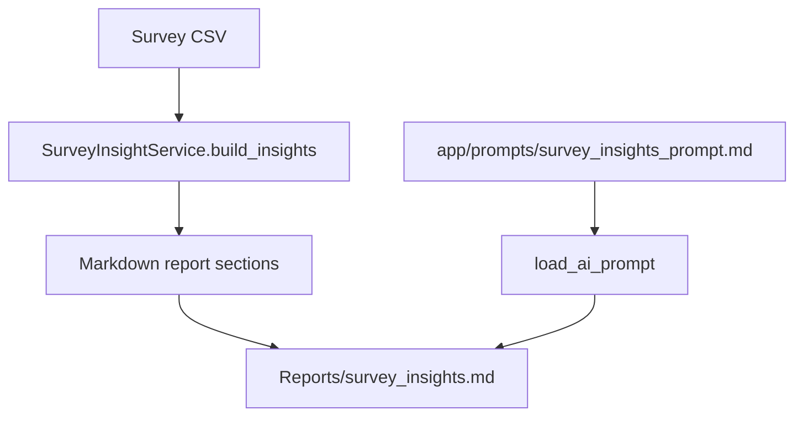

# TEAM_ANALYZER Prompt Library

## Overview

The repository currently contains one prompt file:

```text
app/prompts/survey_insights_prompt.md
```

This prompt is loaded by `SurveyInsightService.load_ai_prompt()` and appended to the generated Markdown report by `SurveyInsightService.export_markdown_report()`. The current code does not execute the prompt against an LLM provider. Instead, it places the prompt inside `Reports/survey_insights.md` under the section `PMCE AI Prompt for Interpretation`.

This means the prompt currently acts as a human/AI handoff artifact: the pipeline prepares data and prompt instructions, but final AI interpretation remains external to the runtime.

## Prompt Inventory

| Prompt File | Status | Runtime Usage | Business Domain |
|---|---:|---|---|
| `app/prompts/survey_insights_prompt.md` | Implemented as static prompt text | Loaded and appended to survey insight Markdown report | Customer Experience, PMCE coaching, CSAT, VOC, QA-style root cause analysis, risk assessment, and operational improvement |

No other prompt files were found in the repository tree.

## `survey_insights_prompt.md`

### Purpose

The prompt instructs an AI assistant to act as a senior Contact Center Operations Manager specializing in:

- Customer Experience.
- PMCE coaching.
- CSAT performance.
- VOC analysis.
- Root cause analysis.
- Continuous operational improvement.

Its purpose is to convert the generated survey insights report into an executive, evidence-based, operationally actionable analysis. It asks the AI to avoid generic conclusions and anchor recommendations in report evidence such as CSAT results, promoter/detractor counts, VOC themes, customer comments, contact IDs, and agent-level performance.

### Inputs

The prompt expects the AI to receive or reference the generated Survey Insights Report. The report currently contains:

- Total survey count.
- Average CSAT.
- Promoter, neutral, and detractor counts.
- Top VOC themes.
- Promoter drivers.
- Detractor drivers.
- Positive VOC samples.
- Negative VOC samples.
- Agent-level survey breakdowns.
- Static user story drafts.

The prompt assumes the report includes enough evidence to support executive conclusions and coaching recommendations.

### Outputs

The prompt requests a structured response with these sections:

1. Executive Summary.
2. What Customers Love.
3. What Customers Dislike.
4. Main VOC Drivers.
5. PMCE Gap Analysis.
6. Agent Performance and PMCE Coaching Forms.
7. Root Cause Analysis.
8. Risk Assessment.
9. Process Improvement Opportunities.
10. PMCE Coaching Action Plan.
11. Customer User Stories.
12. Recommended Next Actions.

The requested output is narrative and operational. It is intended for supervisors, operations leaders, QA stakeholders, and customer experience leaders.

### Dependencies

Runtime code dependencies:

- `SurveyInsightService.load_ai_prompt()` reads the prompt from `app/prompts/survey_insights_prompt.md`.
- `SurveyInsightService.export_markdown_report()` appends the prompt to the generated survey insights report.
- `main.py` calls `SurveyInsightService.export_markdown_report()` through the active pipeline.

Data dependencies:

- Normalized survey records from `SurveyLoader` and `SurveyNormalizer`.
- CSAT and classification output from `SurveyInsightService.build_insights()`.
- VOC theme detection from `SurveyInsightService._detect_theme()`.
- Agent-level breakdowns from `SurveyInsightService.build_insights()`.

Business framework dependencies:

- PMCE framework: Personalize, Manage, Communicate, Execute.
- Coaching gap categories from `AGENTS.md`: Skill Gap, Knowledge Gap, Behavioral Gap, Execution Gap, Accountability Gap, External Factor.
- Risk levels from `AGENTS.md`: Low, Moderate, High, Critical.
- VOC controllability concepts: Agent Controllable, Process Controllable, Policy Driven, System/Operational Constraint, Non-Controllable.

### Business Value

The prompt provides the business interpretation layer that the current rule-based analytics do not yet produce. Its value is to:

- Translate survey metrics into leadership-ready conclusions.
- Connect VOC themes to PMCE coaching behaviors.
- Turn detractor drivers into root-cause and risk assessments.
- Generate agent-level coaching forms from survey evidence.
- Produce operational action plans by time horizon: next 24 hours, next 7 days, and next 30 days.
- Create customer user stories from pain points.
- Support accountability-focused coaching and continuous improvement.

### PMCE Structure

The prompt defines PMCE as:

| PMCE Dimension | Prompt Interpretation |
|---|---|
| Personalize / Human Connection | Empathy, active listening, professionalism, rapport, courtesy, and genuine customer connection. |
| Manage the Conversation / Ownership | Ownership, accountability, conversation control, proactive follow-up, reduced customer effort, and first contact resolution behaviors. |
| Communicate Clearly / Customer Education | Clarity, expectation setting, policy explanations, promotions, returns, shipping, credits, price adjustments, and customer understanding. |
| Execute Resolution / Experience Closure | Complete and accurate resolution, documentation, summary, next steps, and confident closure. |

### Current Runtime Usage

Current behavior:



Important runtime detail:

- The prompt is included in the report but not executed by the application.
- No OpenAI API, local LLM, or model provider is configured in the codebase.
- There is no prompt input templating beyond placing the static prompt after the report content.
- There is no structured AI output schema, parser, or persistence layer.

### Strengths

- The prompt is detailed and aligned with the mission in `AGENTS.md`.
- It requires evidence-backed conclusions rather than generic feedback.
- It covers executive, team, agent, process, risk, coaching, and roadmap outputs.
- It defines a clear PMCE coaching lens.
- It asks for time-bound next actions.

### Limitations

- The prompt is static and not parameterized.
- It asks for more evidence than the current report always provides, such as repeat contacts, escalations, revenue impact, retention impact, and full operational history.
- It does not specify a machine-readable output schema.
- It is not versioned with metadata such as prompt owner, target model, revision date, or evaluation criteria.
- It is not tested.
- It is not connected to an LLM execution service.
- It depends on hard-coded report sections and may drift if report generation changes.

### Recommended Improvements

1. Add prompt metadata at the top of the file, such as name, version, owner, purpose, expected input, expected output, and last updated date.
2. Split the prompt into reusable prompt modules for executive summary, PMCE coaching forms, VOC root cause analysis, and roadmap generation.
3. Add a structured output schema for AI-generated coaching and risk recommendations.
4. Add an LLM execution service that can safely pass the generated report to a model.
5. Add prompt tests or golden examples using small synthetic survey reports.
6. Align report data fields with every evidence requirement in the prompt.
7. Persist AI outputs separately from raw survey reports so generated recommendations can be reviewed, audited, and tracked.

## Missing Prompt Capabilities

The mission implies several additional prompt assets that are not yet present:

| Missing Prompt | Business Need |
|---|---|
| Agent coaching session prompt | Generate the required agent analysis format from `AGENTS.md`: coaching summary, strengths, improvement areas, root cause, risk, SMART commitment, and supervisor recommendation. |
| QA call analysis prompt | Interpret transcript and QA rubric evidence beyond keyword matching. |
| VOC root cause prompt | Classify feedback into controllable/non-controllable drivers, process gaps, policy issues, and agent behavior gaps. |
| Performance recovery plan prompt | Convert multi-metric risk into supervisor action plans. |
| Calibration prompt | Help QA leaders compare evidence, scoring, and audit notes across calls. |
| Survey validation prompt | Explain data quality issues and ingestion failures in business language. |

## Prompt Governance Recommendations

Future prompt files should document:

- Prompt purpose.
- Required inputs.
- Expected outputs.
- Output format or schema.
- Business owner.
- Model assumptions.
- Evidence requirements.
- Known limitations.
- Evaluation examples.
- Version history.

This would make the prompt library easier to maintain as TEAM_ANALYZER evolves from report generation toward AI-assisted operational decision support.
